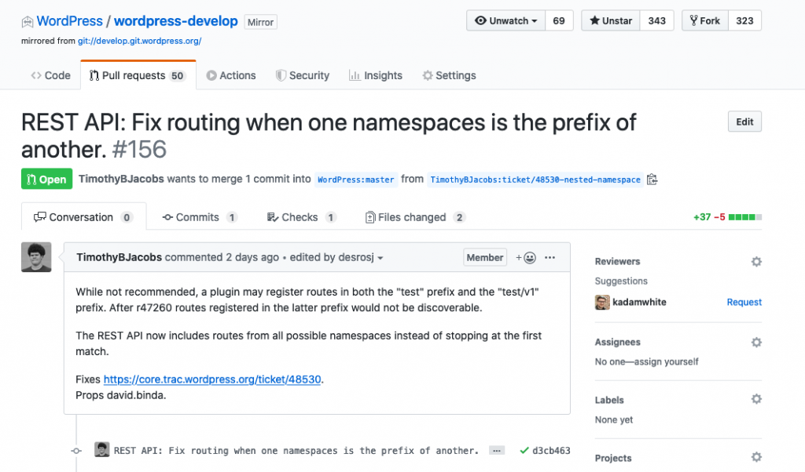

===
Git
===

This page breaks down how to use Git and how our version control workflow operates on club projects.

Git Basics
----------

There are 5 core concepts in Git you need to know: **Commits**, **Pushing**, **Pulling**, **Branches**, and **Pull Requests**.

Commits
~~~~~~~

A **commit** saves the current state of your code locally into your project's commit history. You should commit early and often—it forces you to take small, manageable steps while building features!

To stage and commit your changes, run:

.. code-block:: bash

    git add .
    git commit -m "Describe your changes here"

Pushing
~~~~~~~

**Pushing** uploads your local commits to GitHub so your teammates can see them. You push your code along a specific branch (more on branches below).

.. code-block:: bash

    # 1. Stage and commit your changes first
    git add .
    git commit -m "Describe your changes here"

    # 2. Push your branch up to GitHub
    git push -u origin branch-name

.. note::
   You only need the ``-u`` flag the **first time** you push a new branch. After that, you can simply run ``git push``.

Pulling
~~~~~~~

**Pulling** downloads the latest changes from GitHub to your local machine. Even though each developer works on their own branch, it is good practice to pull updates frequently so your branch stays up to date.

.. code-block:: bash

    git pull origin main

Branches
~~~~~~~~

A **branch** is an isolated copy of the repository where you can edit code and experiment without breaking the working ``main`` code. Every time you start a new task or feature, you should create a new branch!

.. code-block:: bash

    # Create and switch to a new branch (replace with your feature name!)
    git checkout -b feature-branch-name

    # Switch back to an existing branch
    git checkout branch-name

Pull Requests (PRs)
~~~~~~~~~~~~~~~~~~~

A **Pull Request** is a request to **merge** your feature branch into the ``main`` branch. Merging adds all your completed code and assets to the main project build.

1. Push your branch to GitHub.
2. Open your repository page on GitHub.com and click **Compare & pull request**.
3. Fill out a short description of what you built/fixed.
4. One of the code leads will review your changes and merge them into ``main``!

